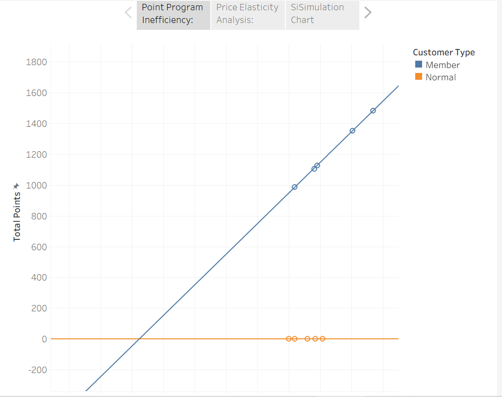
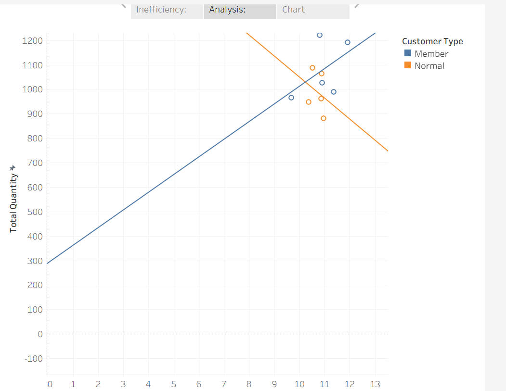
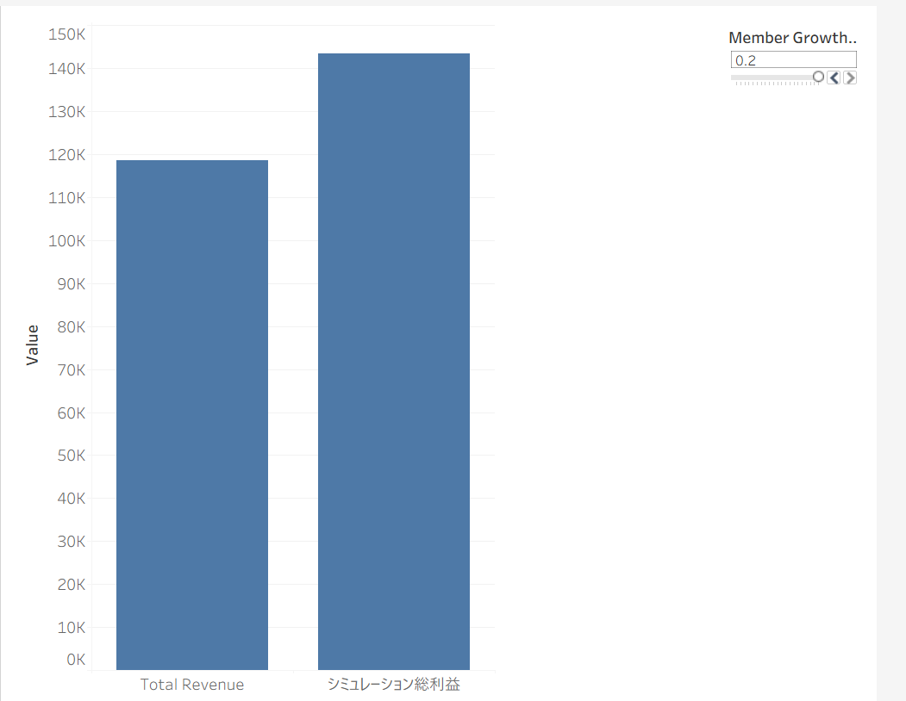

# 📊 Customer Segmentation Point-System Optimization & Profit Simulation

This project identifies structural inefficiencies in a retail store's loyalty program, demonstrates customer price elasticity, and provides a strategic, data-driven simulation to maximize net profit.

## 🛠️ Tech Stack & Tools
- **Data Management:** Google Sheets
- **Data Extraction:** SQL (Data cleaning, aggregation, and core metrics calculation)
- **Data Processing:** Python (Pandas)
- **Visualization & Simulation:** Tableau

## 📈 Executive Summary & Key Insights

1. **Identifying the Flaw (SQL / Tableau):** Discovered that the current point system acts as a flat-rate discount for 'Members', which unnecessarily bleeds profit margins. Conversely, high-value 'Normal' customers spending over $10k receive zero incentives, revealing a severe misallocation of loyalty resources.

2. **Proving Customer Value (Python / Tableau):** Analyzed price elasticity and proved that 'Members' have high price resilience—their purchasing volume remains stable even when unit prices rise. They are true brand loyalists who value quality over cheap discounts.

3. **Strategic Proposal & Live Simulation (Tableau):** Proposed a 20% reduction in baseline point costs, reinvesting those funds into premium, exclusive incentives to convert high-spending 'Normal' customers into registered members. The interactive simulation demonstrates that a 20% growth in membership will dynamically drive a **net profit increase of approximately $23,500 annually**.

---

## 📊 Tableau Dashboard Visualizations

### 1. Point Program Inefficiency (Current Status)

### 2. Price Elasticity Analysis (Proof of Value)

### 3. Future Profit Simulation (Strategic Solution)

---

## 📂 Repository Structure
- `SuperMarket Sales Intermediate.csv`: The raw dataset used for this analysis.
- `analyze_sales.sql`: SQL queries used for data extraction and metric definition.
- `SuperMarket Sales intermidate.ipynb`: Jupyter Notebook containing Python data processing.
- `SuperMarket Sale intermidate.twb`: Tableau workbook file.

# 📊 Customer Segmentation Point-System Optimization & Profit Simulation
### （顧客タイプ別ポイント制度の歪みと利益シミュレーション分析）

This project identifies structural inefficiencies in a retail store's loyalty program, demonstrates customer price elasticity, and provides a strategic, data-driven simulation to maximize net profit.

当プロジェクトでは、小売店舗の購買データから現行のポイント制度の課題を暴き出し、顧客の価格弾力性を証明した上で、利益率を最大化するための戦略転換と未来の利益シミュレーションを提案しました。

---

## 🛠️ Tech Stack & Tools / 使用技術・ツール
- **Data Management:** Google Sheets
- **Data Extraction:** SQL (Data cleaning, aggregation, and core metrics calculation)
- **Data Processing:** Python (Pandas)
- **Visualization & Simulation:** Tableau

---

## 📈 Executive Summary & Key Insights / 分析ストーリーと成果

### 1. Identifying the Flaw / 課題の発見 (SQL / Tableau)
- **EN:** Discovered that the current point system acts as a flat-rate discount for 'Members', which unnecessarily bleeds profit margins. Conversely, high-value 'Normal' customers spending over $10k receive zero incentives, revealing a severe misallocation of loyalty resources.
- **JA:** 会員（Member）への一律のポイント付与が単なる値引きコストと化し、利益を圧迫している一方で、1回あたり1万ドル以上を購入する超優良な一般客（Normal）へのインセンティブがゼロという「制度の歪み」を可視化しました。

### 2. Proving Customer Value / 顧客特性の証明 (Python / Tableau)
- **EN:** Analyzed price elasticity and proved that 'Members' have high price resilience—their purchasing volume remains stable even when unit prices rise. They are true brand loyalists who value quality over cheap discounts.
- **JA:** 会員層の価格弾力性を分析し、会員は単価が上がっても購入数量が落ちない「価格耐性の高いブランドのファン」であることを証明しました。ポイントという「安さ」ではなく、お店の「価値」を信頼している顧客層です。

### 3. Strategic Proposal & Simulation / 戦略提案と未来予測 (Tableau)
- **EN:** Proposed a 20% reduction in baseline point costs, reinvesting those funds into premium, exclusive incentives to convert high-spending 'Normal' customers into registered members. The interactive simulation demonstrates that a 20% growth in membership will dynamically drive a **net profit increase of approximately $23,500 annually**.
- **JA:** 無駄なポイントコストを20%削減し、その原資を一般客の会員化（プレミアム特典）に投資する戦略を提案。シミュレーションの結果、会員数が20%増加した場合、**年間約23,500ドルの純利益増（利益の大幅な押し上げ）**が見込めることを実証しました。

---

## 📊 Tableau Dashboard Visualizations / 作成したダッシュボード

### 1. Point Program Inefficiency (Current Status) / ポイントコストの歪み

### 2. Price Elasticity Analysis (Proof of Value) / 会員層の価格弾力性

### 3. Future Profit Simulation (Strategic Solution) / 未来の利益シミュレーション

---

## 📂 Repository Structure / 同梱ファイル
- `SuperMarket Sales Intermediate.csv`: The raw dataset used for this analysis / 分析に使用した原資データ
- `analyze_sales.sql`: SQL queries used for data extraction and metric definition / データ抽出・集計用SQLクエリ
- `SuperMarket Sales intermidate.ipynb`: Jupyter Notebook containing Python data processing / Pythonによるデータ加工コード
- `SuperMarket Sale intermidate.twb`: Tableau workbook file / Tableauワークブックファイル

---
*Note: The Tableau workbook file is included in this repository. Screenshots of the dashboards can be viewed above.*
